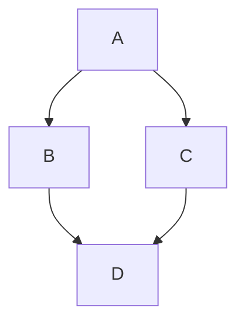

## はじめに

Markdown の良さを伝えたいので記事にしてみた。今回は第 2 回目。Markdown の文法について紹介する。

## 文法

別の解説ページを参考に載せておく。

<https://zenn.dev/zenn/articles/markdown-guide>
<https://github.github.com/gfm/>

### 見出し

セクション、チャプターを分けるために使う。

:::note
`h1` タグは基本的に使わず、`h2` から使うことが多い。1 つの web ページに 1 つの `h1` タグがあるというルールがある。
:::

#### 記法

```txt
# 見出し1 (使わない)
## 見出し2
### 見出し3
#### 見出し4
```

#### 結果

> # 見出し1 (使わない)
>
> ## 見出し2
>
> ### 見出し3
>
> #### 見出し4

### リスト

#### 記法

```txt
- あいうえお
- かきくけこ
    - さしすせそ
    - たちってと
        - なにぬねの
- はひふへほ

1. あいうえお
2. かきくけこ
    1. さしすせそ
    2. たちつてと
        1. なにぬねの
3. はひふへほ
```

#### 結果

- あいうえお
- かきくけこ
  - さしすせそ
    - たちってと
      - なにぬねの
- はひふへほ

1. あいうえお
2. かきくけこ
    1. さしすせそ
        1. たちつてと
            1. なにぬねの
3. はひふへほ

### 引用

入れ子にすることもできる。

#### 記法

```txt
> こんにちは。
> 先日はありがとうございました。
> またよろしくお願いします。
> 
> > こんにちは。
> > 先日はありがとうございました。
> > またよろしくお願いします。
```

#### 結果

> こんにちは。  
> 先日はありがとうございました。  
> またよろしくお願いします。
>
> > こんにちは。  
> > 先日はありがとうございました。  
> > またよろしくお願いします。

### テキストの装飾

#### 記法

```txt
これは *斜体* です。
これは **強調** です。
これは ~~取り消し線~~ です。
これは `code` です。
```

#### 結果

これは *斜体* です。  
これは **強調** です。  
これは ~~取り消し線~~ です。  
これは `code` です。

### コードブロック

プログラムを載せたいときに使う。言語名とファイル名を指定することもできる。

#### 記法

:::note
この例では、コードブロックの中にコードブロックを書いているためインデントを付けているが、本来は必要ない。
:::

```txt
    ```
    console.log("Markdown");
    ```

    ```ts
    console.log("Markdown");
    ```

    ```ts:filename.ts
    console.log("Markdown");
    ```
```

#### 結果

```
console.log("Markdown");
```

```ts
console.log("Markdown");
```

```ts:filename.ts
console.log("Markdown");
```

### リンク

このサイトでは、これらの他にも Twitter と YouTube の埋め込みを作成できる。

:::note
URL をそのまま貼り付ける場合、`<` と `>` で囲む方が好ましい。このサイトでは両方の書き方が使える。
:::

#### 記法

```txt
[GitHub](https://github.com)

https://github.com

<https://github.com>
```

#### 結果

[GitHub](https://github.com)

https://github.com

<https://github.com>

### 画像

#### 記法

```txt

```

#### 結果


### テーブル

左揃え、右揃え、中央揃えができる。

#### 記法

```txt
| Left align | Right align | Center align |
| :--------- | ----------: | :----------: |
| This       |        This |     This     |
| column     |      column |    column    |
| will       |        will |     will     |
| be         |          be |      be      |
| left       |       right |    center    |
| aligned    |     aligned |   aligned    |
```

#### 結果

| Left align | Right align | Center align |
| :--------- | ----------: | :----------: |
| This       |        This |     This     |
| column     |      column |    column    |
| will       |        will |     will     |
| be         |          be |      be      |
| left       |       right |    center    |
| aligned    |     aligned |   aligned    |

### チェックボックス

```txt
- [ ] checkbox
- [x] checked
```

- [ ] checkbox
- [x] checked

### Mermaid

Mermaid.js を使って図を描くことができる。通常のコードブロックの言語名に `mermaid` を指定する。

:::note
このサイトでは Mermaid 未対応。これから対応する予定。
:::

#### 記法

```txt
    ```mermaid
    graph TD;
     A-->B;
     A-->C;
     B-->D;
     C-->D;
    ```
```

#### 結果



### 数式

KaTex を使って数式を記述できる。

#### 記法

```txt
    これは $$C_L$$ です。

    $$
    L = \frac{1}{2} \rho v^2 S C_L
    $$

    ```math
    L = \frac{1}{2} \rho v^2 S C_L
    ```
```

#### 結果

これは $$C_L$$ です。

$$
L = \frac{1}{2} \rho v^2 S C_L
$$

```math
L = \frac{1}{2} \rho v^2 S C_L
```

### 定義リスト

拡張構文であるため、GFM では対応していない。対応しているサービスも少ないが、このサイトでは対応している。

#### 記法

```txt
Node.js
: サーバーサイド JavaScript 実行環境

Deno
: Node.js の後継として開発された JavaScript 実行環境
: typescript が標準でサポートされている

typescript

: JavaScript のスーパーセットであり、静的型付けをサポートする
```

#### 結果

Node.js
: サーバーサイド JavaScript 実行環境

Deno
: Node.js の後継として開発された JavaScript 実行環境
: typescript が標準でサポートされている

typescript

: JavaScript のスーパーセットであり、静的型付けをサポートする

### Fenced Div

Qiita や Zenn で使える拡張構文。GFM では違う記法を使う。このサイトでは 2 種類の記法が使える。

#### 記法

```txt
:::note
これはノートです。
:::

:::warning
これは警告です。
:::
```

#### 結果

:::note
これはノートです。
:::

:::warning
これは警告です。
:::

### 脚注

このサイトでは一番下に表示される。

#### 記法

```txt
これは脚注です[^1]。

[^1]: これは脚注です。
```

#### 結果

これは脚注です[^1]。

[^1]: これは脚注です。

## まとめ

Markdown の文法について紹介した。他にも拡張構文があるが、ここでは紹介しない。
